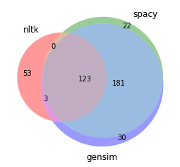

# NLTK, SPACY, GENSIM Stop Words List

### Union of all Stop Words from the three popular libraries.

### Total Stop Words => 412
## [NLTK](https://www.nltk.org/) => 179
## [Spacy](https://spacy.io/) => 326
## [Gensim](https://radimrehurek.com/gensim/) => 337

## Stop Words Visual:

